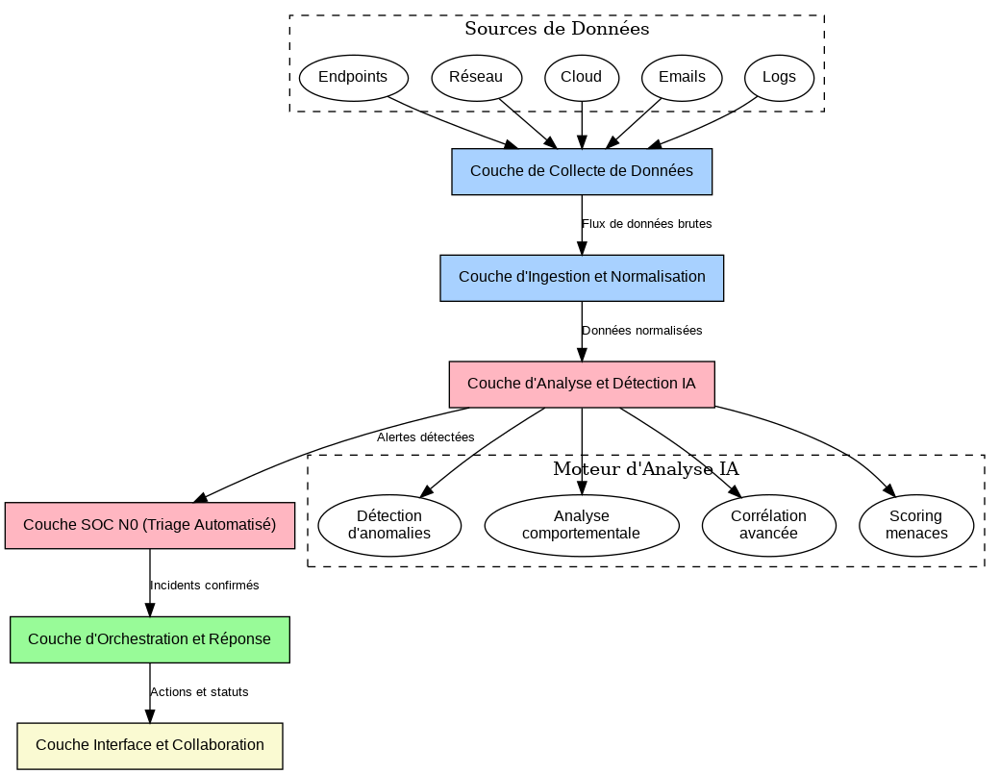
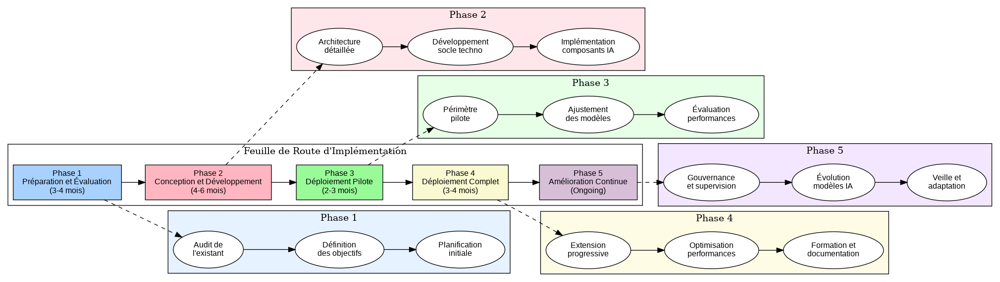

# Solution IA pour Cybersécurité SOC
## Présentation

---

## Sommaire

1. Introduction et contexte
2. Défis actuels des SOC
3. L'IA comme solution transformative
4. Architecture proposée
5. Feuille de route d'implémentation
6. Bénéfices attendus
7. Prochaines étapes

---

## 1. Introduction et contexte

### Qu'est-ce qu'un SOC ?

Un **Centre d'Opérations de Sécurité (SOC)** est une unité centralisée qui :
- Surveille en continu l'environnement informatique
- Détecte les incidents de sécurité
- Analyse les menaces
- Répond aux cyberattaques
- Améliore la posture de sécurité

### Évolution du paysage des menaces

- **Sophistication croissante** des attaques
- **Volume exponentiel** de données à analyser
- **Surface d'attaque élargie** (cloud, IoT, télétravail)
- **Attaques ciblées** et persistantes (APT)
- **Temps de réaction** critique pour limiter les impacts

---

## 2. Défis actuels des SOC

### Volume et complexité

- **4 500 alertes par jour** en moyenne dans un SOC
- Seulement **50%** des alertes sont examinées
- **70%** du temps des analystes consacré au triage
- **Fatigue d'alerte** et taux élevé de faux positifs

### Ressources limitées

- **Pénurie mondiale** de talents en cybersécurité
- **3,5 millions** de postes non pourvus d'ici 2025
- **Turnover élevé** des analystes SOC (12-24 mois)
- **Coûts croissants** de la cybersécurité

### Efficacité opérationnelle

- **MTTD** (Mean Time To Detect) : 197 jours en moyenne
- **MTTR** (Mean Time To Respond) : 69 jours en moyenne
- **Silos d'information** entre les outils de sécurité
- **Manque de contexte** pour prioriser efficacement

---

## 3. L'IA comme solution transformative

### Applications clés de l'IA pour les SOC

- **Détection avancée des menaces**
  - Détection d'anomalies comportementales
  - Identification de menaces inconnues (zero-day)
  - Réduction significative des faux positifs

- **Triage et investigation automatisés**
  - Priorisation intelligente des alertes
  - Enrichissement contextuel automatique
  - Recommandations d'actions pour les analystes

- **Réponse orchestrée**
  - Automatisation des actions de remédiation
  - Playbooks intelligents adaptés au contexte
  - Confinement rapide des menaces

---

## 4. Architecture proposée

### Vue d'ensemble

### Composants clés

1. **Couche de collecte de données**
   - Endpoints, réseau, cloud, emails, logs

2. **Couche d'ingestion et normalisation**
   - Connecteurs standardisés
   - Normalisation et enrichissement

3. **Couche d'analyse et détection IA**
   - SIEM, EDR, NDR, XDR intégrés
   - Moteur d'analyse IA centralisé

4. **Couche SOC N0 (triage automatisé)**
   - Fermeture auto des faux positifs
   - Prétraitement et recommandations
   - Escalade intelligente

5. **Couche d'orchestration et réponse**
   - SOAR avec playbooks automatisés
   - Automatisation des actions
   - Gestion centralisée des incidents

6. **Couche interface et collaboration**
   - Console unifiée pour analystes
   - Assistant IA conversationnel
   - Tableaux de bord et reporting

---

## 5. Feuille de route d'implémentation

### Approche en 5 phases

1. **Préparation et évaluation** (3-4 mois)
   - Audit de l'existant
   - Définition des objectifs
   - Planification initiale

2. **Conception et développement** (4-6 mois)
   - Architecture détaillée
   - Développement du socle technologique
   - Implémentation des composants IA

3. **Déploiement pilote** (2-3 mois)
   - Périmètre limité
   - Ajustement des modèles
   - Évaluation des performances

4. **Déploiement complet** (3-4 mois)
   - Extension progressive
   - Optimisation des performances
   - Formation et documentation

5. **Amélioration continue** (ongoing)
   - Gouvernance et supervision
   - Évolution des modèles IA
   - Veille et adaptation

---

## 6. Bénéfices attendus

### Amélioration des performances

- **Réduction de 90%** du volume d'alertes à traiter manuellement
- **Diminution de 60%** du MTTD (temps de détection)
- **Réduction de 80%** du MTTR (temps de réponse)
- **Détection améliorée** des menaces avancées et inconnues

### Optimisation des ressources

- **Libération de 70%** du temps des analystes pour des tâches à haute valeur
- **Réduction du turnover** des équipes SOC
- **Montée en compétence** des analystes sur des sujets avancés
- **Meilleure allocation** des ressources humaines spécialisées

### Renforcement de la posture de sécurité

- **Visibilité unifiée** sur l'ensemble de l'environnement
- **Capacité proactive** de détection et neutralisation
- **Résilience accrue** face aux attaques sophistiquées
- **Conformité renforcée** avec les exigences réglementaires

---

## 7. Prochaines étapes

### Court terme (1-3 mois)

- **Workshop d'évaluation** de la maturité actuelle
- **Définition détaillée** des cas d'usage prioritaires
- **Élaboration** du business case et ROI
- **Constitution** de l'équipe projet

### Moyen terme (3-6 mois)

- **Sélection** des technologies et partenaires
- **Conception détaillée** de l'architecture
- **Développement** des premiers composants
- **Préparation** du déploiement pilote

### Long terme (6-12 mois)

- **Déploiement progressif** de la solution complète
- **Formation** des équipes SOC
- **Optimisation continue** des modèles IA
- **Mesure des bénéfices** et ajustements

---

## Merci de votre attention

### Questions ?

Contact: [votre_email@domaine.com]
